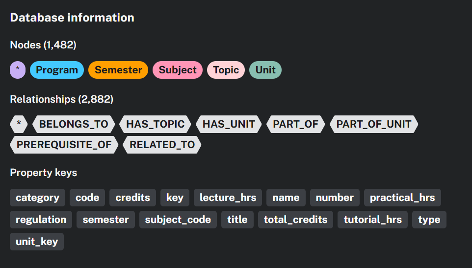

The ultimate goal of this project is to build a NotebookLM-like web app but make it more personalized for the user.

Typically, the response generated will not only be dependent on the provided sources. Instead of depending only on the sources, I aim to make a cohesive platform for students based on their entire curriculum. Students upload their course regulations or documents, and various data such as semesters, subjects, and topics are extracted from them. Relationships are then established between the data components. Similar topics are connected, and available prerequisites of the topics are linked. [Refer to the DB image attached below for the entire schema]

Students can provide the available resources for each semester, and the resource documents are chunked and loaded into the database with relationships between them. If the student prompts for a particular topic, the topic is searched along with its related topics, its prerequisites, and the resources connected to it. The agent (Gemini) is then asked to explain the topic by starting with the prerequisite topic, if any, and then moving on to the specified topic. This ensures better understanding.


The notebook UI in `curriculum_notebook.html` is now the main project surface. The older curriculum explorer dashboard has been removed from the app flow.

Notebook navigation now uses route-style pages under `/app`, for example `/app/semester/6`, `/app/semester/6/subject/23N604`, and `/app/semester/6/subject/23N604/upload`, so browser back and forward work without refresh.

Right now the implementation is just an interface that connects all the subjects, topics, and semesters based on various relations. No resource for the topics has been chunked or uploaded in the db.

CHALLENGES:
1. Rate limit of Gemini is hindering the feature to extract useful information from the regulation to make it modular instead of just hardcoding the relationship extraction.
2. Huge process of chunking which could be inefficient when done manually without the help of agent.
3. i need to implementing some indexing mechanis for the chunks for efficient retrieval process thus decreasing the latency





To execute:
python backend/main.py
python backend/api.py

url: [127.0.0.1:8000](http://127.0.0.1:8000/app)

### Project layout

The codebase is now split into focused folders:

```text
backend/   FastAPI apps, graph logic, loaders, RAG pipeline, and vector storage
frontend/  Notebook, upload, and regulation HTML pages
img/       Diagrams and screenshots
chroma_store/  Local Chroma data for fallback mode
```

The implementation lives under `backend/`. Run the app with `python backend/main.py` or `python backend/api.py`.

### Chroma storage

By default, uploaded documents now go to Chroma Cloud instead of the local `chroma_store/` directory.

Set these environment variables to connect the ingestion pipeline to your cloud collection:

```env
CHROMA_API_KEY=your_chroma_cloud_api_key
CHROMA_TENANT=your_tenant
CHROMA_DATABASE=your_database
CHROMA_BACKEND=cloud
```

If you need the old on-disk behavior for local testing, set `CHROMA_BACKEND=local`.

### PostgreSQL auth and student graph

Authentication credentials now live in PostgreSQL, while student academic structure stays in Neo4j.

Set these environment variables for the auth store:

```env
POSTGRES_HOST=localhost
POSTGRES_PORT=5432
POSTGRES_DB=yggdrasil
POSTGRES_USER=postgres
POSTGRES_PASSWORD=your_password
POSTGRES_SSLMODE=prefer
```

Available API routes:

- `POST /auth/register` creates a PostgreSQL user with a hashed password.
- `POST /auth/login` verifies the PostgreSQL user password.
- `POST /students` upserts a Neo4j `Student` node and links it to `Program`, `College`, `Regulation`, and `Semester`.
- `GET /students/{student_id}` fetches the Neo4j student profile.